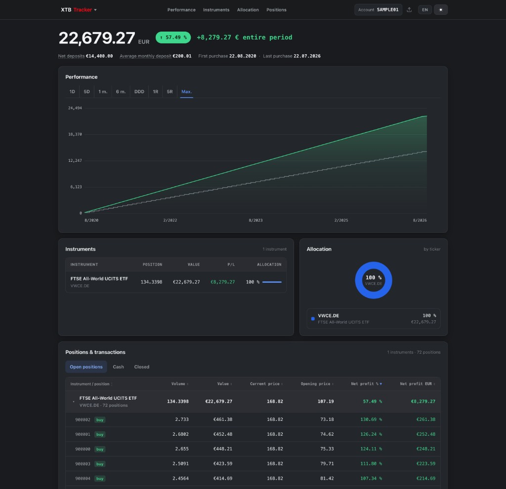
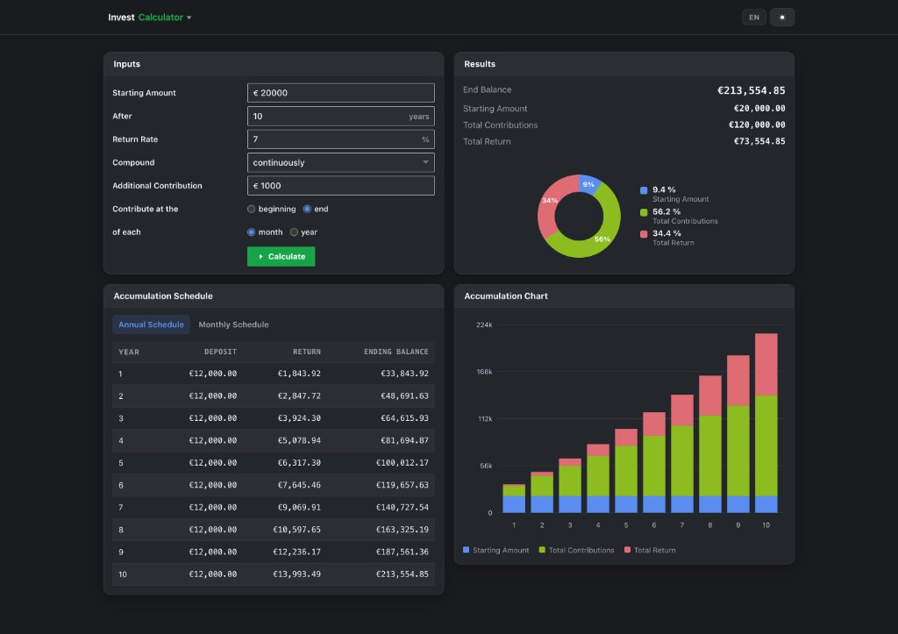

# Finance Tools

**[emanuel-burdej.github.io/financetools](https://emanuel-burdej.github.io/financetools/)**

**[emanuel-burdej.github.io/financetools/xtbTracker](https://emanuel-burdej.github.io/financetools/xtbTracker.html)**

**[emanuel-burdej.github.io/financetools/investmentCalculator](https://emanuel-burdej.github.io/financetools/investmentCalculator.html)**

Two small browser apps for personal investing. Everything stays in your browser.

## What you get

- **XTB Tracker** — load an XTB `.xlsx` export and review portfolio value, performance over time, instruments, allocation, and open/closed positions. Drag-and-drop or pick a file; nothing is uploaded anywhere.
- **Investment Calculator** — project compound growth with starting amount, rate, contributions, and compounding (including continuous). Results show end balance, schedule table, and charts.

SK and EN. Dark and light mode. Theme and language are shared between both apps.

## Screenshots

**XTB Tracker**



**Investment Calculator**



## Structure

```
FinanceTools/
  xtbTracker.html
  investmentCalculator.html
  docs/screenshots/
```

Plain HTML, CSS, and JavaScript. No build step. Open either file in a browser, or use the GitHub Pages link above.
